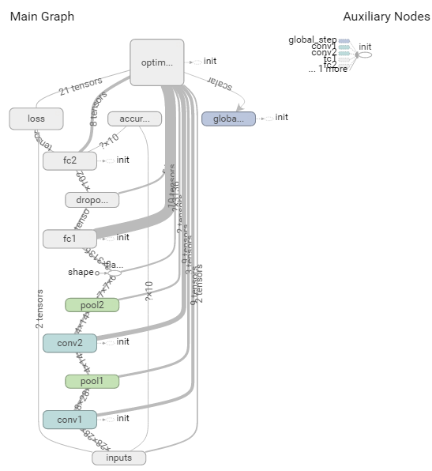

# deep-insight-tensorflow

## Requirements:
- Python >= 3.5
- `tensorflow` >= `1.0.0rc`
- `keras`

Can install dependencies through freezed requirements file:
```bash
$ pip install -r requirements.txt
```

### Implementations
Three different implementations:
- `KerasFramework`: Keras
- `TensorflowFramework`: Tensorflow
- `TensorflowStdFramework`: Tensorflow with [TFRecord](https://www.tensorflow.org/how_tos/reading_data/#standard_tensorflow_format)

## Commands

```bash
$ python main.py

Usage: main.py [FRAMEWORK] [MODE]
```

### KerasFramework
```bash
$ python main.py keras [MODE]
```
`[MODE]` can be:
- `train`
- `evaluate`
- `predict`

or training in short with `Makefile`
```bash
# Train with Keras
$ make keras
```

### TensorflowFramework
```bash
$ python main.py tf [MODE]
```
`[MODE]` can be:
- `train`
- `evaluate`
- `export`
- `predict`

or training in short with `Makefile`
```bash
# Train with Tensorflow and use regular images + labels as input
$ make tf
```

### TensorflowStdFramework
```bash
$ python main.py tfr [MODE]
```
`[MODE]` can be:
- `train`
- `evaluate`
- `gen_tfrecord`

or training in short with `Makefile`
```bash
# Train with Tensorflow and use pre-generated TFRecord as input
$ make tfr
```

*Note*: do generate the TFRecord before training by using this command first.
```bash
$ python main.py tfr gen_tfrecord
```


## Exporting & Applying Model
```bash
# export trained model (including `GraphDef` and 'variables') into single file
$ python main.py tf export

# restore and apply model onto inputs
$ python main.py tf predict
```

## Network Graph
Network of MNIST can visulize as graph in Tensorboard.


